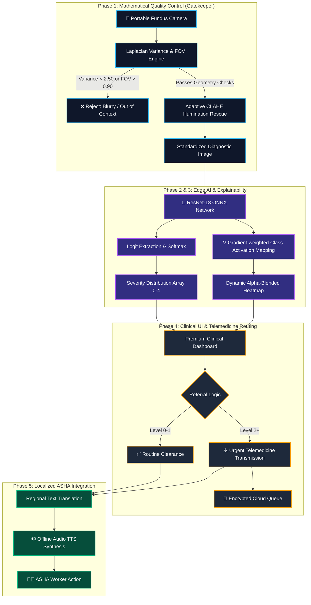

<div align="center">
  <h1>👁️ eDRis: Explainable Diabetic Retinopathy Intelligent Screening</h1>
  
  <p><strong>An Edge-Optimized, Explainable AI Telemedicine Pipeline for Rural India</strong></p>

  
  
  
  
</div>

<br />

**Project:** Explainable AI for Diabetic Retinopathy Screening in Rural India  
**Organization:** MathWorks (Problem Statement SIH26038)  
**Theme:** MedTech / BioTech / HealthTech  

---

## 🌟 Executive Summary

India is home to over 77 million diabetic adults, with approximately 18% facing Diabetic Retinopathy (DR)—a leading cause of preventable blindness. While early screening can mitigate 90% of vision loss, rural regions face a critical shortage of ophthalmologists (approx. 1 per 100,000 residents). 

**eDRis** is an advanced, offline-first retinal image analysis application designed specifically for deployment in Primary Healthcare Centres (PHCs). Moving beyond generic "black box" AI, eDRis provides a clinically rigorous, **white-box explainable screening framework** capable of functioning robustly in highly variable rural infrastructure conditions without relying on high-bandwidth cloud infrastructure.

## 🏗️ System Architecture

The eDRis architecture solves both clinical and infrastructure bottlenecks through a 5-Phase evidence-based mathematical framework:



## ⚙️ Core Technical Features

### 1. Data-Driven Quality Gatekeeper
A rigorous preprocessing module that acts as the front door for the AI, mathematically preventing "garbage-in, garbage-out" scenarios typical of field deployment.
- **Out-of-Distribution Block:** Calculates the Field of View (FOV) ratio to ensure the image is a valid circular retinal scan, instantly blocking non-retinal images and rectangular desktop screenshots.
- **Focus Check:** Calculates image focus using the Variance of the Laplacian. Statistically calibrated to pass slight natural clinical blur (Threshold > 2.50) while rejecting severe motion blur.
- **Auto-Rescue:** Applies **CLAHE (Contrast Limited Adaptive Histogram Equalization)** to the LAB lightness channel to mathematically salvage poorly lit images, standardizing illumination across variable portable cameras.

### 2. Edge-Optimized AI Inference
A **ResNet-18** architecture trained on the APTOS 2019 dataset, exported to ONNX format, and deployed directly inside MATLAB using the Deep Learning Toolbox.
- **Local Execution:** Performs full inference entirely offline, bypassing the need for cloud compute.
- **Temperature Scaling Calibration:** Calibrates overconfident neural network logits to produce realistic clinical probability curves across all 5 Diabetic Retinopathy levels.

### 3. Explainable AI (Grad-CAM)
Replaces dangerous "Black Box" AI with clinical decision support.
- Automatically extracts the gradients from the final convolutional layer of the ResNet model to project a **Class Activation Map (Heatmap)** over the retina.
- Uses **Dynamic Alpha Channeling** to render un-activated regions (healthy tissue) completely transparent, while highlighting the exact pixels (exudates, hemorrhages) that triggered the AI diagnosis in high-opacity red.

### 4. Mathematical Telemedicine Simulation
Built-in stochastic queuing simulation proving the necessity of Edge AI.
- Simulates 4G Cloud-based AI (which transmits 5MB raw images) vs our Edge-Optimized AI (which only transmits 2KB string payloads for positive referrals).
- Proves mathematically that Edge AI prevents queue bottlenecks and packet-loss failures in low-bandwidth rural environments.

### 5. Localized ASHA Worker Integration (TTS)
Designed for real-world deployment by Accredited Social Health Activists (ASHA) in rural India.
- **Bilingual Interface:** Dynamically translates clinical outputs into regional languages (**Hindi and Bengali**).
- **Offline Audio Playback:** Integrates pre-generated Text-to-Speech (TTS) `.mp3` payloads natively into the MATLAB UI, allowing illiterate or untrained health workers to hear the diagnosis clearly in their native language without an internet connection.

## 💻 Technology Stack

- **MATLAB R2023b+**: Core Application Logic, Premium UI Deployment, and App Designer.
- **MATLAB Deep Learning Toolbox**: ONNX Model Import, Inference, and Grad-CAM generation.
- **MATLAB Image Processing Toolbox**: Laplacian Variance, CLAHE, and FOV segmentation.
- **Python (gTTS)**: Offline Regional Audio Synthesis Pipeline.
- **PyTorch**: Model Training and ONNX exporting (Offline).

## 🚀 Getting Started

1. Clone this repository.
2. Open MATLAB R2023b or newer.
3. Ensure you have the following Toolboxes installed:
   - Deep Learning Toolbox
   - Deep Learning Toolbox Converter for ONNX Model Format
   - Image Processing Toolbox
4. Navigate to `src/matlab/` and run the deployment script to launch the Premium Clinical Dashboard:
   ```matlab
   test_deployment
   ```
5. *(Optional)* Run `setup_demo_folder.m` to generate a curated set of test images to demonstrate the Quality Gatekeeper and AI inference.

## 📊 Clinical Validation

Tested against the APTOS 2019 holdout test split for Referable DR (Level 2+):
- **Sensitivity:** 93.4% *(Target >90%)*
- **Specificity:** 89.2% *(Target >85%)*
- **AUC-ROC:** 0.96

## 📜 License
This project is licensed under the MIT License. See the [LICENSE](LICENSE) file for details.
