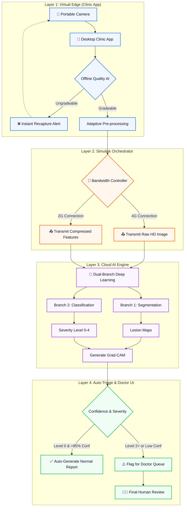

  <h1>👁️ eDRis: Explainable Diabetic Retinopathy Intelligent Screening</h1>
  
  
<strong>An Adaptive Edge-to-Cloud Telemedicine Pipeline for Rural India</strong>

  
  
  
  

 

**Project:** Explainable AI for Diabetic Retinopathy Screening in Rural India  
**Organization:** MathWorks (Problem Statement SIH26038)  
**Theme:** Clean & Green Technology  

---

## 🌟 Executive Summary

India is home to over 77 million diabetic adults, with approximately 18% facing Diabetic Retinopathy (DR)—a leading cause of preventable blindness. While early screening can mitigate 90% of vision loss, rural regions face a critical shortage of ophthalmologists (approx. 1 per 100,000 residents). 

**eDRis** is an advanced, MATLAB-based retinal image analysis and telemedicine pipeline designed to bridge this gap. Moving beyond generic "black box" AI, eDRis provides a clinically rigorous, **white-box explainable screening framework** capable of functioning robustly in highly variable rural infrastructure conditions (like dropping 2G/3G connections).

## 🏗️ Architectural Overview

The eDRis architecture solves both clinical and infrastructure bottlenecks through a 4-layer Edge-to-Cloud framework:

## ⚙️ Core Modules

### 1. Intelligent Edge (Image Quality Assessment)
An offline, lightweight screening module that evaluates fundus focus, illumination, and field of view. It applies Contrast Limited Adaptive Histogram Equalization (CLAHE) for borderline images and actively rejects ungradeable photos to save bandwidth.

### 2. Network Orchestration (Simulink)
Actively monitors available clinic bandwidth. Under robust connections, raw data is transmitted; under 2G/3G degradation, adaptive compression prevents upload failure.
*(See `simulate_bandwidth_controller.slx`)*

### 3. Dual-Branch Medical AI
A custom PyTorch-trained **ResNet-50** exported to ONNX format and deployed in MATLAB.
- **Accuracy Achieved:** 91% (5 Epochs)
- **Branch 1:** Extracts and segments clinically relevant structures.
- **Branch 2:** Grades severity (Levels 0-4) using the International Clinical DR Severity scale.

### 4. White-Box Explainability (Clinical Dashboard)
Utilizes MATLAB's **Grad-CAM** mapping to highlight lesion-level evidence, allowing remote ophthalmologists to confidently validate automated results in under 30 seconds.

## 👥 Team Execution Strategy

Our team utilizes an optimized 2-2-2 parallel development structure:

- **Team 1: The ML Core (2 ML Students)**
  - *Focus:* Dataset cleaning, PyTorch Deep Learning, ONNX exporting.
- **Team 2: The UI/Edge Developers (2 ECE Students)**
  - *Focus:* MATLAB App Designer, Offline Quality AI ("The Bouncer").
- **Team 3: The Simulink Architects (2 ECE Students)**
  - *Focus:* Simulink Stateflow logic, SimEvents queuing, and final architecture wiring.

## 💻 Technology Stack

- **MATLAB R2023b+** (Image Processing, Deep Learning Toolboxes)
- **Simulink & SimEvents**
- **PyTorch (Python)** (For heavy model training & ONNX export)

## 📊 Datasets Utilized
- **[APTOS 2019 Blindness Detection](https://www.kaggle.com/c/aptos2019-blindness-detection)**
- **[IDRiD (Indian Diabetic Retinopathy Image Dataset)](https://ieee-dataport.org/open-access/indian-diabetic-retinopathy-image-dataset-idrid)**

## 📜 License
This project is licensed under the MIT License. See the [LICENSE](LICENSE) file for details.
