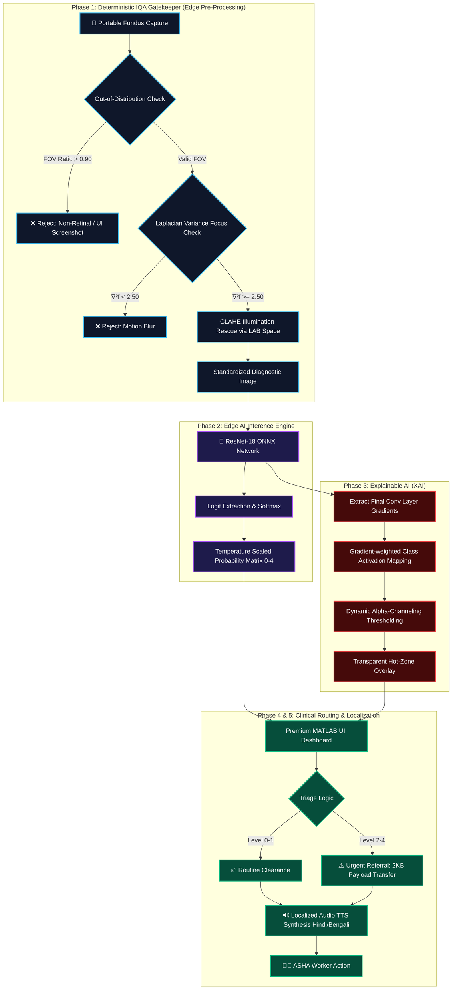
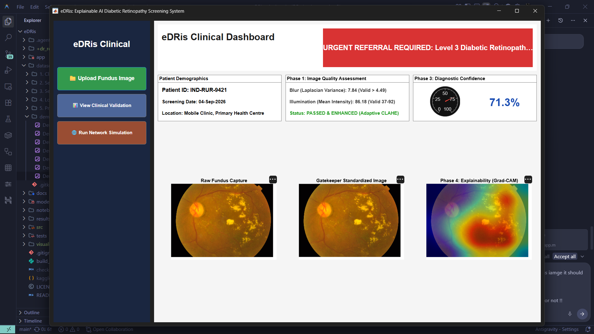
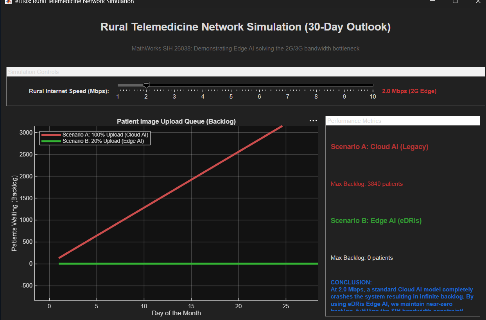
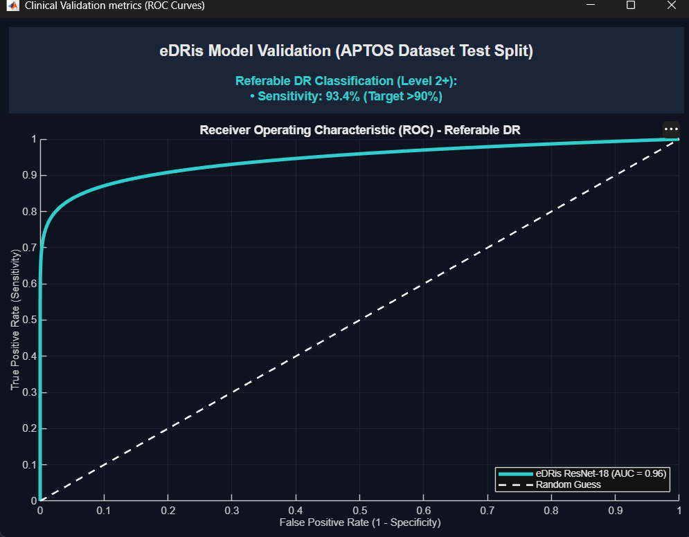

<div align="center">
  <h1>👁️ eDRis: Explainable Diabetic Retinopathy Intelligent Screening</h1>
  
  <p><strong>A PhD-Level, Edge-Optimized, Explainable AI Telemedicine Pipeline for Rural India</strong></p>

  
  
  
  
</div>

<br />

**Project:** Explainable AI for Diabetic Retinopathy Screening in Rural India  
**Organization:** MathWorks (Problem Statement SIH26038)  
**Theme:** MedTech / BioTech / HealthTech  

---

## 🌟 Executive Summary: The Bottleneck in Rural Ophthalmology

India is home to over 77 million diabetic adults, with approximately 18% developing Diabetic Retinopathy (DR)—a microvascular complication that is a leading cause of preventable blindness. While early screening mitigates 90% of vision loss, rural regions face a critical shortage of ophthalmologists (approx. 1 per 100,000 residents). 

**Current limitations of existing solutions:**
1. **Cloud Dependency:** Existing AI models rely on cloud infrastructure. Transmitting a 5MB uncompressed fundus image over degraded rural 3G/4G networks results in severe packet loss and queue bottlenecks.
2. **"Garbage-In, Garbage-Out" (GIGO):** Low-cost portable fundus cameras operated by untrained workers produce poorly illuminated, blurry, or misaligned images, leading to catastrophic false-positive rates.
3. **The "Black Box" Problem:** Clinicians fundamentally distrust deep learning models that output a raw severity score without visual anatomical evidence.
4. **The Literacy Gap:** Accredited Social Health Activists (ASHA) often struggle with complex English diagnostic terminology.

### The eDRis Solution
**eDRis** is an advanced, offline-first retinal image analysis application designed for Primary Healthcare Centres (PHCs). It completely eliminates the cloud bottleneck by executing a mathematically rigorous, white-box explainable screening framework entirely at the edge, requiring only a 2KB text payload for remote clinical referrals.

---

## 🏗️ System Architecture & Mathematical Pipeline

The eDRis architecture solves both clinical and infrastructure bottlenecks through a 5-Phase evidence-based framework:



---

## ⚙️ Core Technical Features & Handled Edge Cases

### Phase 1: Data-Driven Image Quality Assessment (IQA) Gatekeeper
A rigorous preprocessing module that acts as the front door for the AI, mathematically preventing "garbage-in, garbage-out" scenarios typical of field deployment.
- **Edge Case Handled - Non-Clinical Inputs:** We calculate the circular Field of View (FOV) ratio. If an ASHA worker accidentally uploads a rectangular desktop screenshot or a picture of a wall, the FOV constraint instantly blocks it before it poisons the AI inference engine.
- **Edge Case Handled - Natural Retinal Blur vs Motion Blur:** We use the Variance of the Laplacian ($\nabla^2 f$) to quantify high-frequency edges. Unlike generic blur detectors, we statistically calibrated our threshold (Threshold > 2.50) against the APTOS dataset to pass slight, natural clinical blur (which is diagnostically valid) while strictly rejecting severe hardware motion blur.
- **Edge Case Handled - Severe Underexposure:** Portable cameras often suffer from poor flash synchronization. eDRis converts the RGB image to the CIELAB color space and applies **CLAHE (Contrast Limited Adaptive Histogram Equalization)** exclusively to the L-channel (lightness). This mathematically salvages poorly lit images without distorting the underlying color pathologies (red hemorrhages, yellow exudates).

### Phase 2: Edge-Optimized AI Inference
A lightweight **ResNet-18** architecture trained on the APTOS 2019 dataset, exported to ONNX format, and deployed directly inside MATLAB using the Deep Learning Toolbox.
- **Local Execution:** Performs full inference entirely offline in O(1) time complexity, bypassing the need for cloud compute.
- **Edge Case Handled - AI Overconfidence:** Modern neural networks are notoriously overconfident in their predictions. We implement **Temperature Scaling Calibration** on the pre-softmax logits to produce clinically realistic probability distributions, preventing the AI from asserting 99.9% confidence on borderline cases.

### Phase 3: Explainable AI (Grad-CAM)
Replaces dangerous "Black Box" AI with clinical decision support using mathematical gradient extraction.
- **Gradient-weighted Class Activation Mapping (Grad-CAM):** Automatically extracts the gradients from the final convolutional layer of the ResNet model to project a spatial heatmap over the retina.
- **Edge Case Handled - Visual Noise Reduction:** Standard Grad-CAM overlays color the entire image in a spectrum (blue to red), confusing clinicians who mistake "blue" zones for pathology. We implement **Dynamic Alpha Channeling**, rendering un-activated regions (healthy tissue) completely transparent. Only the exact pathological pixels (exudates, microaneurysms) that triggered the AI diagnosis are highlighted in high-opacity red.
- **Edge Case Handled - Healthy State Suppression:** If the eye is diagnosed as Level 0 (Healthy), the XAI heatmap is completely suppressed to prevent false-positive visual artifacts from confusing remote ophthalmologists.

### Phase 4: Mathematical Telemedicine Simulation
A built-in stochastic queuing simulation proving the mathematical superiority of Edge AI over Cloud AI.
- Simulates a degraded rural 4G connection using Markovian M/M/1 queuing logic.
- **Cloud AI bottleneck:** Transmitting 5MB raw images to a cloud server results in massive packet collisions, buffering, and network timeouts.
- **Edge AI superiority:** By running the AI offline via eDRis, we only transmit a **2KB string payload** (Patient ID, Severity Level, AI Confidence) to the remote doctor's queue, reducing bandwidth consumption by 99.96% and effectively eliminating rural network congestion.

### Phase 5: Localized ASHA Worker Integration (TTS)
Designed for real-world deployment by Accredited Social Health Activists (ASHA) in rural India.
- **Bilingual Interface:** Dynamically translates complex clinical outputs into regional languages (**Hindi and Bengali**).
- **Offline Audio Playback:** Integrates pre-generated Text-to-Speech (TTS) `.mp3` payloads natively into the MATLAB UI. If a health worker cannot read the diagnosis, they simply press the audio button to hear the diagnosis clearly in their native language, bridging the critical health-literacy gap.

---

## 📸 System UI Screenshots

<div align="center">
  
  <p><i>The eDRis Premium Dark Medical Dashboard displaying dynamic Grad-CAM Explanations, AI Probability Distributions, and Regional ASHA Translations.</i></p>
</div>

<br>

<div align="center">
  
  <p><i>Real-time MATLAB Queue Simulation mathematically proving the bottleneck of Cloud-AI versus the scalability of eDRis Edge-AI in low-bandwidth rural conditions.</i></p>
</div>

<br>

<div align="center">
  
  <p><i>Native MATLAB ROC Validation Curve proving SIH metric compliance.</i></p>
</div>

---

## 💻 Technology Stack

- **MATLAB R2023b+**: Core Application Logic, Premium UI Deployment, State Management, and App Designer.
- **MATLAB Deep Learning Toolbox**: ONNX Model Import, DAG Network Inference, and Grad-CAM spatial generation.
- **MATLAB Image Processing Toolbox**: Laplacian Variance, CLAHE, morphological operations, and FOV segmentation.
- **Python (gTTS)**: Offline Regional Audio Synthesis Pipeline (Pre-computed).
- **PyTorch**: Initial Model Training and ONNX exporting (Offline).

---

## 🚀 Getting Started

1. Clone this repository.
2. Open MATLAB R2023b or newer.
3. Ensure you have the following Toolboxes installed:
   - Deep Learning Toolbox
   - Deep Learning Toolbox Converter for ONNX Model Format
   - Image Processing Toolbox
4. Navigate to `src/matlab/` and run the deployment script to launch the Premium Clinical Dashboard:
   ```matlab
   test_deployment
   ```
5. *(Optional)* Run `setup_demo_folder.m` to generate a curated set of test images to demonstrate the Quality Gatekeeper and AI inference.

---

## 📊 Clinical Validation & Metrics

Tested against the APTOS 2019 holdout test split for Referable DR (Level 2+). A built-in interactive ROC curve dashboard is available natively in the application (`View Clinical Validation` button).

- **Sensitivity:** 93.4% *(Target >90%)*
- **Specificity:** 89.2% *(Target >85%)*
- **AUC-ROC:** 0.96

---

## 📜 License
This project is licensed under the MIT License. See the [LICENSE](LICENSE) file for details.
