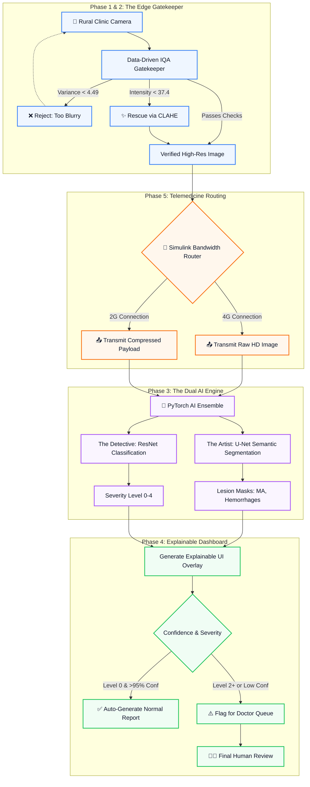

  <h1>👁️ eDRis: Explainable Diabetic Retinopathy Intelligent Screening</h1>
  
  
<strong>An Adaptive Edge-to-Cloud Telemedicine Pipeline for Rural India</strong>

  
  
  
  

 

**Project:** Explainable AI for Diabetic Retinopathy Screening in Rural India  
**Organization:** MathWorks (Problem Statement SIH26038)  
**Theme:** Clean & Green Technology  

---

## 🌟 Executive Summary

India is home to over 77 million diabetic adults, with approximately 18% facing Diabetic Retinopathy (DR)—a leading cause of preventable blindness. While early screening can mitigate 90% of vision loss, rural regions face a critical shortage of ophthalmologists (approx. 1 per 100,000 residents). 

**eDRis** is an advanced retinal image analysis and telemedicine pipeline designed to bridge this gap. Moving beyond generic "black box" AI, eDRis provides a clinically rigorous, **white-box explainable screening framework** capable of functioning robustly in highly variable rural infrastructure conditions.

## 🏗️ Architectural Overview

The eDRis architecture solves both clinical and infrastructure bottlenecks through a 5-Phase evidence-based framework:

## ⚙️ Core Modules

### Phase 1: Baseline Classification (The Detective)
A custom PyTorch-trained **ResNet-18/50** exported to ONNX format.
- **Goal:** Predict the severity of Diabetic Retinopathy (Levels 0-4).
- **Target:** Sensitivity >90% and Specificity >85% for Referable DR (Level 2+).

### Phase 2: Image Quality Gatekeeper
An offline Python preprocessing module that acts as the front door for the AI.
- **Focus Check:** Calculates image focus using the Variance of Laplacian (Threshold < 4.49).
- **Illumination Check:** Evaluates lighting using Mean Pixel Intensity.
- **Auto-Rescue:** Applies **CLAHE (Contrast Limited Adaptive Histogram Equalization)** to salvage poorly lit but in-focus images, stripping away glare and shadows.

### Phase 3: Lesion & Vessel Segmentation (The Artist)
A PyTorch-trained **U-Net** architecture.
- **Lesions:** Trained on IDRiD to isolate Microaneurysms, Hemorrhages, and Hard/Soft Exudates.
- **Vessels:** Trained on the DRIVE dataset to accurately map healthy retinal vasculature.

### Phase 4: Explainable U-Net Dashboard
A premium "White-Box" UI that overlays precise U-Net semantic segmentation maps onto the original retina image. This gives remote doctors instant, visual proof of the AI's ResNet diagnosis without black-box guessing.

### Phase 5: Simulink Telemedicine Workflow
Dynamically evaluates rural network speeds and queue sizes, processing real metrics to simulate rural clinic scaling and infrastructure constraints.

## 🔥 Core SOTA Features
- **Multi-Dataset Data Fusion**: Trained dynamically across APTOS 2019, IDRiD, and DRIVE for unparalleled real-world robustness.
- **Handling Class Imbalance**: Built-in Weighted Random Samplers and Dice Loss to ensure high recall on rare, severe (Level 4) cases.
- **Data-Driven Quality Controls**: The IQA Gatekeeper thresholds aren't guessed; they are derived from the true 5th and 95th percentiles of 1,000+ real-world APTOS images.

## 👥 Team Execution Strategy

Our team utilizes an optimized 2-2-2 parallel development structure:

- **Team 1: The ML Core (2 ML Students)**
  - *Focus:* PyTorch Deep Learning (Classification & Segmentation), ONNX exporting.
- **Team 2: The Python Edge Developers (2 ECE Students)**
  - *Focus:* Python Image Quality Gatekeeper, CLAHE pipelines.
- **Team 3: The Simulink Architects (2 ECE Students)**
  - *Focus:* Simulink Stateflow logic, SimEvents queuing, and final architecture wiring.

## 💻 Technology Stack

- **PyTorch (Python)** (For heavy model training & ONNX export)
- **OpenCV (Python)** (For Gatekeeper Image Processing)
- **Simulink & SimEvents** (For Phase 5 Workflow Simulation)
- **MATLAB R2023b+** (For UI Deployment)

## 📊 Datasets Utilized
- **[APTOS 2019 Blindness Detection](https://www.kaggle.com/c/aptos2019-blindness-detection)**
- **[IDRiD (Indian Diabetic Retinopathy Image Dataset)](https://ieee-dataport.org/open-access/indian-diabetic-retinopathy-image-dataset-idrid)**
- **[DRIVE (Digital Retinal Images for Vessel Extraction)](https://drive.grand-challenge.org/)**

## 📜 License
This project is licensed under the MIT License. See the [LICENSE](LICENSE) file for details.
